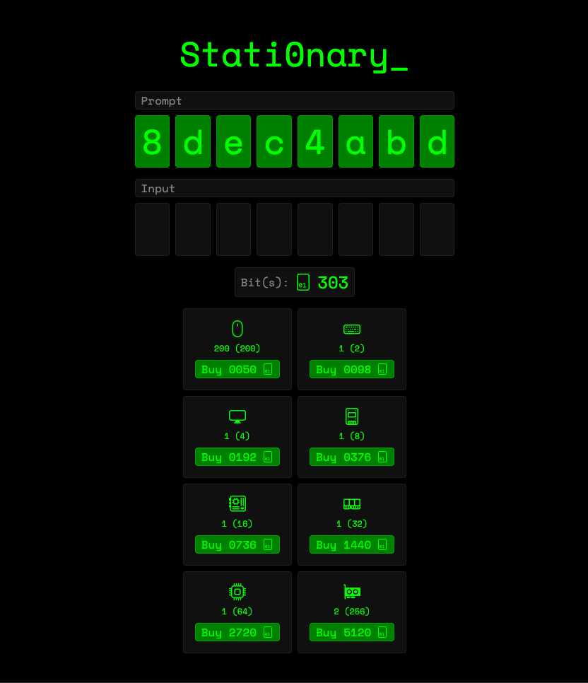

<h1 align='center'>Stationary</h1>
<h3 align='center'>Typing game</h3>
<h5 align='center'>Enter in the prompt -> Get bits -> Buy upgrades -> Repeat</h5>

<hr/>

<p align='center'><b>Built with</b></p>
<p align='center'>
  
  
   
</p>



## Local development

- Install dependencies

```bash
bun i
```

- Set environment variables

In your `.env` file define following variables:
`SUPABASE_URL`
`SUPABASE_KEY`

```env
SUPABASE_URL='{YOUR SUPABASE URL}'
SUPABASE_KEY='{YOUR SUPABASE KEY}'
URL='localhost:7337'
```

- Start development server

```bash
bun run dev
```
