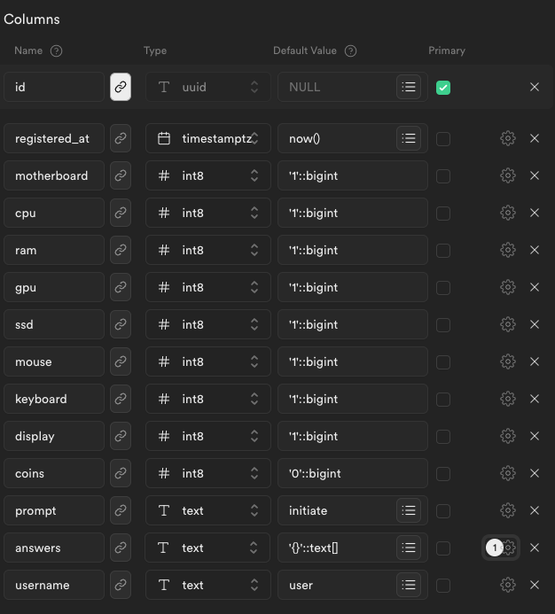
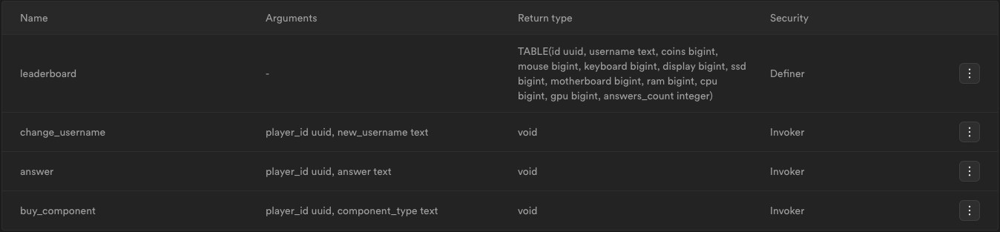

<h1 align='center'>Stationary</h1>
<h3 align='center'>Typing game</h3>
<h5 align='center'>Enter in the prompt -> Get bits -> Buy upgrades -> Repeat</h5>

<hr/>

<p align='center'><b>Built with</b></p>
<p align='center'>
  
  
   
</p>


## Local development

- Install dependencies

```bash
bun i
```

- Set environment variables

In your `.env` file define following variables:
`SUPABASE_URL`
`SUPABASE_KEY`

```env
SUPABASE_URL='{YOUR SUPABASE URL}'
SUPABASE_KEY='{YOUR SUPABASE KEY}'
URL='localhost:7337'
```

- Start development server

```bash
bun run dev
```

## Database

### Table:



### Functions:



<details>
  <summary>Functions code</summary>

`leaderboard`

```sql
BEGIN RETURN QUERY SELECT
  players.id,
  players.username,
  players.coins,
  players.mouse,
  players.keyboard,
  players.display,
  players.ssd,
  players.motherboard,
  players.ram,
  players.cpu,
  players.gpu,
  array_length(players.answers, 1) as answers_count FROM players
ORDER BY
  players.coins DESC,
  answers_count DESC,
  players.gpu DESC,
  players.cpu DESC,
  players.ram DESC,
  players.motherboard DESC,
  players.ssd DESC,
  players.display DESC,
  players.keyboard DESC,
  players.mouse DESC;
END;
```

<hr>

`change_username`

```sql
BEGIN
  IF new_username ~ '^[a-zA-Z0-9]+$' THEN
    UPDATE public.players SET username = new_username WHERE id = player_id;
  ELSE
    RAISE EXCEPTION 'Invalid username. It must match the regex [a-zA-Z0-9].';
  END IF;
END;
```

<hr>

`answer`

<details>
  <summary>SPOILER - Easter egg</summary>

```sql
BEGIN
  UPDATE public.players
  SET coins = coins +
  (
    (mouse * 1) + (keyboard * 2) + (display * 4) + (ssd * 8) + (motherboard * 16) + (ram * 32) + (cpu * 64) + (gpu * 128)
  ) +
  CASE WHEN answer = 'supabase' AND NOT ('supabase' = ANY(answers)) THEN
    1337
  ELSE
    0
  END,
  prompt =
  CASE WHEN coins = 1337 AND NOT ('supabase' = ANY(answers)) THEN
    'supabase'
  ELSE
    encode(gen_random_bytes(4), 'hex')
  END,
  answers = answers || answer
  WHERE id = player_id AND prompt = answer;
END;
```

</details>

<hr>

`buy_component`

```sql
BEGIN
  IF component_type = 'mouse' THEN
    UPDATE public.players SET mouse = mouse + 1 WHERE id = player_id AND coins >= 50;
    UPDATE public.players SET coins = coins - 50 WHERE id = player_id AND coins >= 50;
  ELSIF component_type = 'keyboard' THEN
    UPDATE public.players SET keyboard = keyboard + 1 WHERE id = player_id AND coins >= 98;
    UPDATE public.players SET coins = coins - 98 WHERE id = player_id AND coins >= 98;
  ELSIF component_type = 'display' THEN
    UPDATE public.players SET display = display + 1 WHERE id = player_id AND coins >= 192;
    UPDATE public.players SET coins = coins - 192 WHERE id = player_id AND coins >= 192;
  ELSIF component_type = 'ssd' THEN
    UPDATE public.players SET ssd = ssd + 1 WHERE id = player_id AND coins >= 376;
    UPDATE public.players SET coins = coins - 376 WHERE id = player_id AND coins >= 376;
  ELSIF component_type = 'motherboard' THEN
    UPDATE public.players SET motherboard = motherboard + 1 WHERE id = player_id AND coins >= 736;
    UPDATE public.players SET coins = coins - 736 WHERE id = player_id AND coins >= 736;
  ELSIF component_type = 'ram' THEN
    UPDATE public.players SET ram = ram + 1 WHERE id = player_id AND coins >= 1440;
    UPDATE public.players SET coins = coins - 1440 WHERE id = player_id AND coins >= 1440;
  ELSIF component_type = 'cpu' THEN
    UPDATE public.players SET cpu = cpu + 1 WHERE id = player_id AND coins >= 2720;
    UPDATE public.players SET coins = coins - 2720 WHERE id = player_id AND coins >= 2720;
  ELSIF component_type = 'gpu' THEN
    UPDATE public.players SET gpu = gpu + 1 WHERE id = player_id AND coins >= 5120;
    UPDATE public.players SET coins = coins - 5120 WHERE id = player_id AND coins >= 5120;
  END IF;
END;
```

</details>
